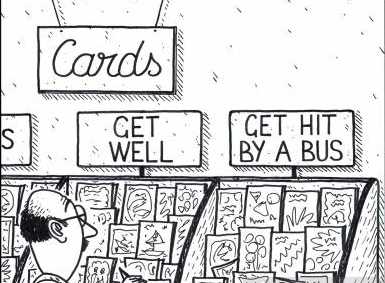
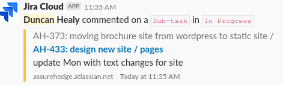
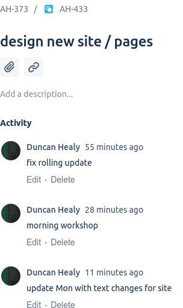
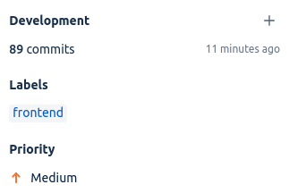
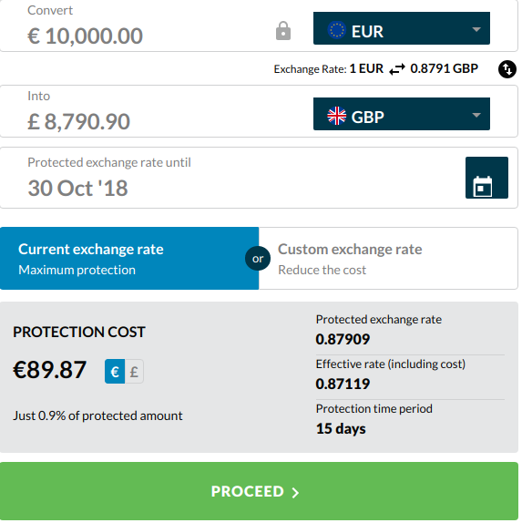
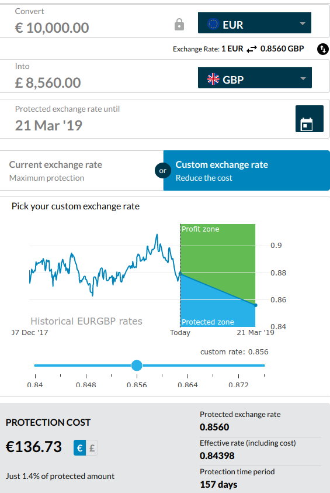
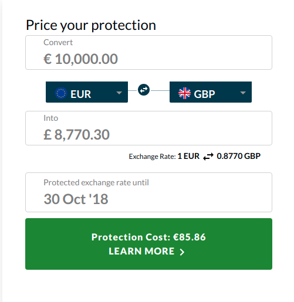
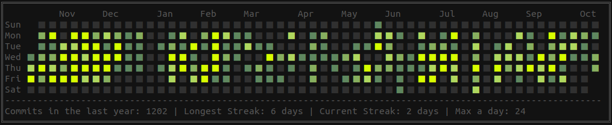

# Dogpatch Oct 16th 2018


## Intro

- Duncan Healy: A kid that learned to code by Poking 
- Fun fact: Most developers are actually mad scientists in disguise

- Assure Hedge: A fintech based in Dogpatch


Information overload 


Can you remember more than 3 seconds?


Lets have a look at some Spot rates


```json
{
    "EURUSD": 1.150345,
    "USDJPY": 113.628,
    "GBPUSD": 1.309405,
    "USDCHF": 0.99221,
    "EURCHF": 1.141405,
    "AUDUSD": 0.705075,
    "USDCAD": 1.294525,
    "NZDUSD": 0.64405,
    "EURGBP": 0.878525,
    "EURJPY": 130.721,
    "GBPJPY": 148.7905,
    "CHFJPY": 114.5325,
}
```


```json
{
    "GBPCHF": 1.2991700000000002,
    "EURAUD": 1.6315,
    "EURCAD": 1.489155,
    "AUDCAD": 0.91275,
    "AUDJPY": 80.118,
    "CADJPY": 87.77850000000001,
    "NZDJPY": 73.1845,
    "GBPCAD": 1.695035,
    "GBPNZD": 2.0330500000000002,
    "GBPAUD": 1.8570950000000002,
    "AUDNZD": 1.0948,
    "USDSEK": 9.083265,
}
```


```json
{
    "EURSEK": 10.449,
    "EURNOK": 9.52048,
    "USDNOK": 8.27635,
    "USDMXN": 18.990465,
    "AUDCHF": 0.6995899999999999,
    "EURNZD": 1.7861,
    "USDZAR": 14.83275,
    "ZARJPY": 7.660005,
    "USDTRY": 6.14851,
    "EURTRY": 7.0729500000000005,
    "NZDCHF": 0.6390199999999999,
    "CADCHF": 0.7664599999999999,
}
```


```json
{
    "NZDCAD": 0.833725,
    "TRYJPY": 18.47,
    "EURMXN": 21.847245,
    "EURZAR": 17.0626,
    "GBPSEK": 11.89422,
    "GBPNOK": 10.837534999999999,
    "GBPZAR": 19.4222,
    "CHFSEK": 9.154499999999999,
    "CHFNOK": 8.341245,
    "AUDSEK": 6.404535,
    "AUDNOK": 5.8353850000000005,
    "CADSEK": 7.0168800000000005,
    "CADNOK": 6.3936,
}
```


```json
{
    "SEKJPY": 12.510304999999999,
    "NOKJPY": 13.730025000000001,
    "NOKSEK": 1.09754
}
```


- AH Joke about what would happen if I got hit by a bus.


- Every time I exit CHQ I check behind me just in case they want to test that theory





### How do we help our companies survive when the inevitable Bus crash occurs?


### We document

- [ADR](https://github.com/npryce/adr-tools) https://github.com/npryce/adr-tools

### Now we can remember those decisions we made when we were a lot less wise and why we made them


Add adr to path and
```
adr init doc/architecture/decisions
adr new This is the most important decision ever and \ 
    if I do not write it down it will be forgotten
```


### Cluster crash


- Try recover from that bus

---

## What do we do at AH

- We connect SME to the wider world of FX products
- We provide an API for larger instituions to offer Hedging to their clients


### Deploy 

[](https://asciinema.org/a/HKnUr4XL9BCBVbHkqDqDcn8gE?autoplay=1&speed=3&theme=tango&size=medium)


Anything wrong?











### Rollback

[](https://asciinema.org/a/WNXtJjKiydFjij0WG6PpWuT02?autoplay=1&speed=3&theme=tango&size=medium)

---

## Code


## Test

[](https://asciinema.org/a/e2SSEIMrPmpjtwM8oD7XFjKyQ?autoplay=1&speed=3&theme=tango&size=medium)


[Report](report.json.html)


[limits](report.limit.html)


```yaml
apiVersion: v1
items:
- apiVersion: autoscaling/v1
  kind: HorizontalPodAutoscaler
  metadata:
    annotations:
      alpha/target.custom-metrics.podautoscaler.kubernetes.io: '{"items":[{"name":"qps",
        "value": "20"}]}'
      autoscaling.alpha.kubernetes.io/conditions: '[{"type":"AbleToScale","status":"True","lastTransitionTime":"2018-10-16T09:55:21Z","reason":"SucceededRescale","message":"the
        HPA controller was able to update the target scale to 4"},{"type":"ScalingActive","status":"True","lastTransitionTime":"2018-10-16T09:51:20Z","reason":"ValidMetricFound","message":"the
        HPA was able to successfully calculate a replica count from cpu resource utilization
        (percentage of request)"},{"type":"ScalingLimited","status":"True","lastTransitionTime":"2018-10-16T09:55:21Z","reason":"ScaleUpLimit","message":"the
        desired replica count is increasing faster than the maximum scale rate"}]'
      autoscaling.alpha.kubernetes.io/current-metrics: '[{"type":"Resource","resource":{"name":"cpu","currentAverageUtilization":272,"currentAverageValue":"30m"}}]'
    creationTimestamp: 2018-10-16T09:49:19Z
    name: static-site
    namespace: demo
    resourceVersion: "2872376"
    selfLink: /apis/autoscaling/v1/namespaces/demo/horizontalpodautoscalers/static-site
    uid: c0a7955c-d128-11e8-bb6c-56d5d265a1ee
  spec:
    maxReplicas: 8
    minReplicas: 2
    scaleTargetRef:
      apiVersion: apps/v1beta1
      kind: Deployment
      name: static-site-v1
    targetCPUUtilizationPercentage: 80
  status:
    currentCPUUtilizationPercentage: 272
    currentReplicas: 2
    desiredReplicas: 4
    lastScaleTime: 2018-10-16T09:55:21Z
kind: List
metadata:
  resourceVersion: ""
  selfLink: ""

```


[post hpa](hpa.json.html)


```yaml
{{- if .Values.autoscaleMin }}
apiVersion: autoscaling/v2beta1
kind: HorizontalPodAutoscaler
metadata:
    name: {{ .Chart.Name }}
    namespace: {{ .Release.Namespace }}
    annotations:
      alpha/target.custom-metrics.podautoscaler.kubernetes.io: '{"items":[{"name":"qps", "value": "20"}]}'
spec:
    maxReplicas: {{ .Values.autoscaleMax }}
    minReplicas: {{ .Values.autoscaleMin }}
    targetCPUUtilizationPercentage: 80
    scaleTargetRef:
      apiVersion: apps/v1beta1
      kind: Deployment
      name: {{ .Values.service.name }}-{{ .Chart.Version | replace "." "-"  }}
{{ end }}
```


[2nd hpa](hpa2.json.html)


[4th hpa](hpa4.json.html)


[](https://asciinema.org/a/RWEbnvXAQBMgeQ8JE9G0QC8xm?autoplay=1&speed=10&theme=tango&size=medium)


[flood](flood.json.html)


---

```json
{
    "EURUSD": 1.150345,
    "USDJPY": 113.628,
    "GBPUSD": 1.309405,
    "USDCHF": 0.99221,
    "EURCHF": 1.141405,
    "AUDUSD": 0.705075,
    "USDCAD": 1.294525,
    "NZDUSD": 0.64405,
    "EURGBP": 0.878525,
    "EURJPY": 130.721,
    "GBPJPY": 148.7905,
    "CHFJPY": 114.5325,
}
```

We have a range of currency pairs and floating point numbers for each


## What can we do with this?











### Useful Data

- Currency Pairs https://github.com/assurehedge/currencypairs
- Rates


### Currency Ranking

```json
{
    EUR: 1, 
    GBP: 2, 
    AUD: 3, 
    NZD: 4, 
    USD: 5, 
    CAD: 6, 
    CHF: 7, 
}
```


### Missing pairs

```json
  ZAR:
   { EUR: [ 'ZAR/EUR', 0.05860771511961835 ],
     GBP: [ 'ZAR/GBP', 0.051487473097795305 ],
     USD: [ 'ZAR/USD', 0.06741838162174917 ],
     CAD: [ 'ZAR/CAD', null ],
     CHF: [ 'ZAR/CHF', null ],
     JPY: [ 'ZAR/JPY', 7.660005 ],
     AUD: [ 'ZAR/AUD', null ],
     NZD: [ 'ZAR/NZD', null ],
     SEK: [ 'ZAR/SEK', null ],
     NOK: [ 'ZAR/NOK', null ],
     MXN: [ 'ZAR/MXN', null ] } 
```


### Infer


### Transform

```js
  return new require('stream').Transform({
    transform: function transformer(chunk, encoding, callback){
        // callback(<error>, <result>)
        callback(false, chunk.map(a => {
            // operations on Buffer 
            return a 
        })
    }
  })
```


